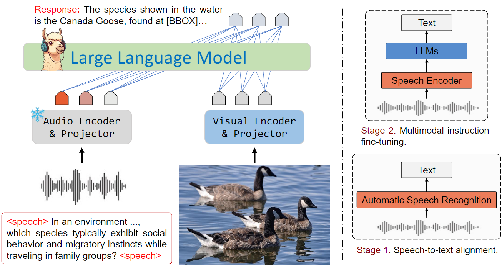
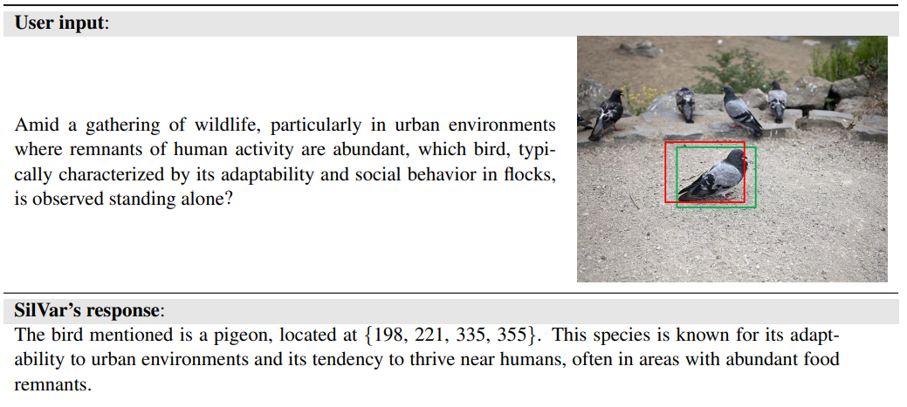

# **SILVAR** 🚀  
### **Reasoning Speech Instruction with a Visual Language Model**  

> **The first end-to-end speech-driven VLM for object localization & text generation! 🎙️➡️🖼️**  

SILVAR processes speech **directly** with a **Whisper encoder**, eliminating the need for intermediate text conversion before passing instructions to models like **GPT-4o Mini** or **Gemini 1.5**.  

🔥 **Key Highlights:**  
✅ **End-to-end Speech-to-Vision Reasoning** – No text conversion needed!  
✅ **State-of-the-Art Performance** – Competes with top models on **MMMU & ScienceQA**.  
✅ **Efficient & Scalable** – Comparable results with fewer parameters.  


### **📌 Why SILVAR?**  
Existing VLMs require text input, but **SILVAR directly understands speech** for object localization and reasoning, pushing the boundaries of speech-driven AI!  

🔗 **[Check out the Paper](https://arxiv.org/abs/2412.16771)** | 💻 **[Try the Demo](#)**  


### **🛠️ Supported Models**  
SILVAR is designed for flexibility, allowing seamless integration with various state-of-the-art models. Currently, the supported models include:  

- **📝 Language Models**: Mistral, Llama (2, 3, 3.1), Deepseek R1 (Distill Llama 8B)  
- **🖼️ Vision Encoders**: CLIP and its variants (e.g., Biomed-CLIP)  
- **🎙️ Audio Encoders**: Whisper and its variants  


### **💡 Get Involved**  
If you're excited about SILVAR and want to contribute, feel free to open an issue or submit a PR! 🚀  

📩 **Contact us:** hanhpt.phamtan@gmail.com  

---

<p  align="center"></p>


**SILVAR** is an end-to-end visual language model that uses speech as input instructions for reasoning visual question answering and object localization.

<p  align="center"></p>


---
## Installation

```bash
conda create -n silvar python=3.10.13
conda activate silvar
git clone https://github.com/Hanhpt23/SilVar.git
cd SilVar
pip install -r requirements.txt
```


## Training
### Visual encoder and audio encoder setting
We have released our checkpoint [here](https://drive.google.com/file/d/1flUkhhSJqA-jvzZABAgeIucHpu3WhBSv/view?usp=drive_link), you can download and use it as a pretrained weight or for inference.


### Training Configuration
- Set the pretrained checkpoint for downstream tasks [here](train_configs/train.yaml#L10) at Line 10.
- Set the training image path [here](train_configs/train.yaml#L35) at Line 35
- Set the training annotation path [here](train_configs/train.yaml#L36) at Line 36
- Set the training audio path [here](train_configs/train.yaml#L37) at Line 37
- Set the output directory [here](train_configs/train.yaml#L54) at Line 54
- Set the wandb token [here](train_configs/train.yaml#L69) at Line 69
- If you want to train the model end-to-end, set `freeze_vision` and `freeze_audio` to `False` [here](train_configs/train.yaml#L17) on lines 17 and 18


### Evaluation Configuration
- Set the checkpoint [here](eval_configs/evaluate.yaml#L10) at Line 10.
- Set the evaluation image path [here](eval_configs/evaluate.yaml#L36) at Line 36
- Set the evaluation annotation path [here](eval_configs/evaluate.yaml#L35) at Line 35
- Set the evaluation audio path [here](eval_configs/evaluate.yaml#L38) at Line 38
- Set the output directory [here](eval_configs/evaluate.yaml#L54) at Line 54

### Run
- To run on a terminal:

```bash
torchrun --nproc_per_node 2 train.py \
        --cfg-path train_configs/train.yaml\
        --cfg-eval-path eval_configs/evaluate.yaml\
        --eval-dataset audio_val
```

- To submit to an HPC:
```bash
sbatch scripts/silvar/train.sh
```

## Evaluation
- To run on a terminal:
```bash
torchrun --nproc_per_node 2 evaluate.py \
      --cfg-path eval_configs/evaluate.yaml\
      --eval-dataset audio_val
```

- To submit to an HPC:
```bash
sbatch scripts/silvar/evaluate.sh
```

## Dataset structure
```
Silvar
├── train
│   ├── audio
│   ├── images
│   ├── train.json
├── test
│   ├── audio
│   ├── images
│   ├── test.json

└── pretrained_checkpoint
    └── checkpoint_19.pth
```


<!-- ## Update
-  🔥 Ongoing Work: We are exploring its applications in other domains.
-  🔥 January 31, 2025 – We integrated DeepSeek R1 (Distilled Llama 8B) and released its trained weights [DeepSeek R1](https://huggingface.co/deepseek-ai/DeepSeek-R1-Distill-Llama-8B).
-  🔥 December 20, 2024 – We updated the code and released trained weights with the vision encoder [CLIP](https://huggingface.co/openai/clip-vit-base-patch16), the audio encoder [Whisper Tiny](https://huggingface.co/openai/whisper-tiny), and the LLM [Llama 3.1 8B](https://huggingface.co/meta-llama/Llama-3.1-8B) . -->
<!-- - December 15, 2024 – We submitted the paper and released the code anonymously [here](https://anonymous.4open.science/r/SilVar-8911/README.md). -->

<!-- ## Acknowledgement
We would like to thank the following open-source projects:
- [MiniGPT](https://github.com/Vision-CAIR/MiniGPT-4)
- [Whisper](https://github.com/openai/whisper)
- [Llama](https://huggingface.co/meta-llama/Llama-3.1-8B)
- We also extend our gratitude to our friends, Le Duc Khai and Nguyen Ngoc Son, for their valuable feedback.

## Citation

```bibtex
@article{pham2024silvar,
  title={SilVar: Speech Driven Multimodal Model for Reasoning Visual Question Answering and Object Localization},
  author={Pham, Tan-Hanh and Le, Hoang-Nam and Nguyen, Phu-Vinh and Ngo, Chris and Hy, Truong-Son},
  journal={arXiv preprint arXiv:2412.16771},
  year={2024}
}
```
 -->
